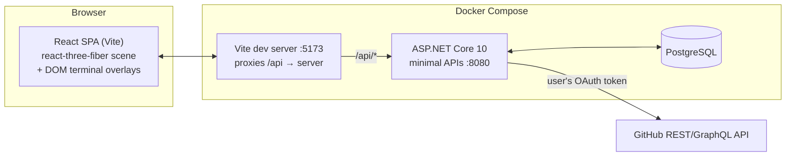
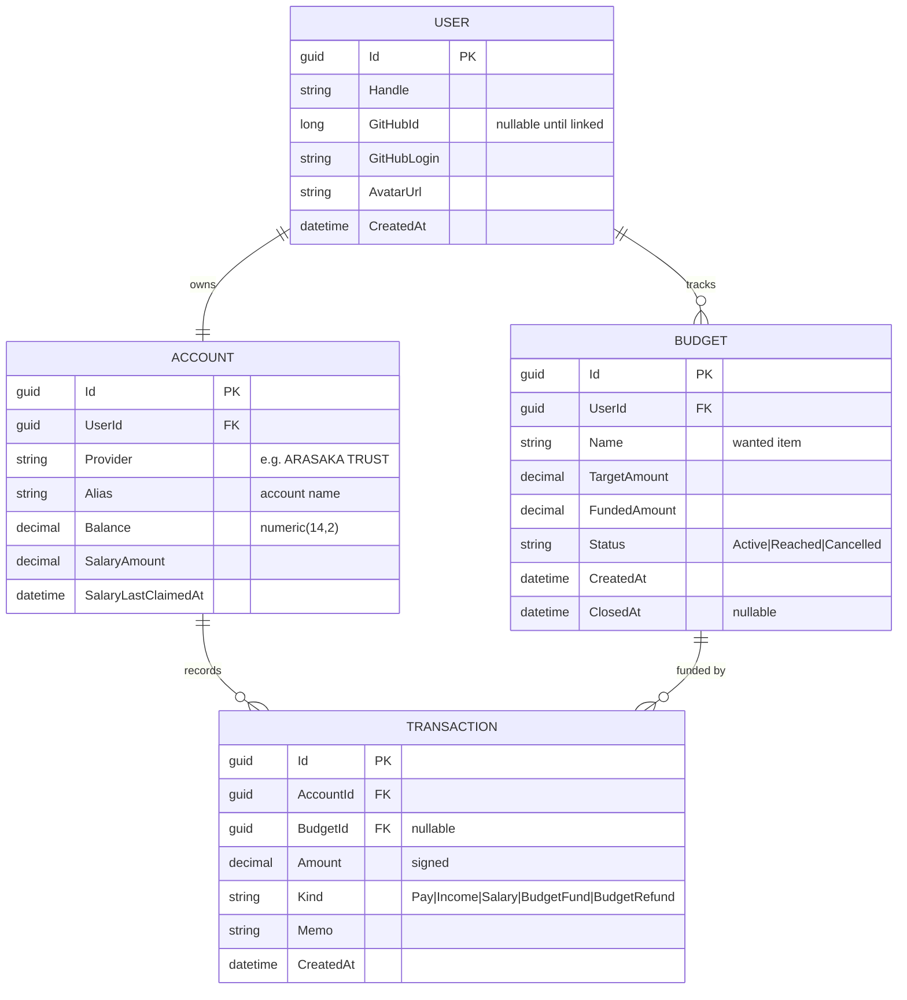

# Architecture — CYBER-DASHBOARD // BLACKWALL

*Phase 0 design. Living document — update as decisions land in [DECISIONS.md](DECISIONS.md).*

---

## 1. System overview



**One origin.** The browser only ever talks to the Vite origin (`localhost:5173`); Vite proxies `/api` to the API container. That makes plain `SameSite=Lax` cookie auth work with zero CORS configuration. In production the API serves the built SPA itself (same idea, one container).

**The API is the only thing holding secrets.** GitHub OAuth token never reaches the browser; the SPA only ever sees JSON shaped by our API.

---

## 2. The experience

### 2.1 Scroll journey (Acts 1–5)

The whole journey is **one R3F `<Canvas>`** with a scroll rig mapping normalized progress `t ∈ [0,1]` to: camera position along a `CatmullRomCurve3`, per-act shader uniforms, and postprocessing intensities.

| Act | t range | Scene content | Key tech |
|-----|---------|--------------|----------|
| 1 — Approach | 0.00–0.25 | Void, dust particles, the **Blackwall**: large plane, custom GLSL (layered FBM noise, red emissive bands crawling upward, occasional lightning filaments). Glitching HUD text (`BLACKWALL // PERIMETER`). | custom `ShaderMaterial`, drei `Text`/`Html` for HUD |
| 2 — Contact | 0.25–0.40 | Camera accelerates into the wall. Wall shader amplitude + Glitch/ChromaticAberration postFX ramp to a whiteout-in-red. | postprocessing uniforms driven by `t` |
| 3 — Breach | 0.40–0.70 | Data tunnel: camera inside a long tube; instanced glyph quads + light streaks flying past; lore text fragments drift by. | `InstancedMesh`, additive blending, fog |
| 4 — Decompression | 0.70–0.85 | Tunnel decays; the office room fades in from wireframe → lit (shader dissolve or material crossfade). | material lerp, `EffectComposer` settling |
| 5 — The Den | 0.85–1.00 | Camera settles into the room at desk height. Scroll input ends; **interactive mode** begins. | camera handoff to `CameraControls` |

Scroll implementation: **GSAP ScrollTrigger + Lenis** (smooth scroll) writing progress into a zustand store; `useFrame` reads it. (Alternative considered: drei `ScrollControls` — see DECISIONS D-04.) A DOM element ~600vh tall provides the scroll length; the canvas is fixed.

### 2.2 Interactive mode (the room)

- Room contents: desk, 2 monitors (interactable), tower/deck, chair, neon signage, window with rain/skyline card, cables, clutter. Red/black Arasaka-inspired palette, emissive accents, 1 key light + neon fills.
- Idle behavior: subtle camera parallax on pointer move (few degrees), monitor screens run animated shader "screensavers" (scanlines + logo).
- **Monitor interaction:** hover → screen brightens + edge glow (raycast highlight). Click → GSAP camera dolly to a head-on framing of that screen (~0.8s), then a fullscreen DOM terminal overlay fades in, visually matched to the screen bezel (CRT curvature frame, scanline overlay). `ESC` or an on-screen `[DISCONNECT]` reverses it.
- Why DOM overlay instead of in-3D UI: crisp text, native input/IME/copy-paste/accessibility for free. The 3D screen still renders a low-res mirror of the terminal (nice-to-have later via render-to-texture; not required for v1).

### 2.3 Terminals

Both terminals share one React terminal core (custom, ~keyboard-driven; not xterm.js unless we later want PTY-grade behavior):

- prompt, blinking block cursor, command history (↑/↓), `Tab` autocomplete, `clear`, `help`
- typewriter output rendering, ASCII banners on boot ("ARASAKA TRUST v2.3.1 — UNAUTHORIZED ACCESS WILL BE TRACED")
- a **command registry**: `{ name, args schema, handler, help }` per command; handlers call typed API client functions. Parsing is client-side; the API stays clean REST (see DECISIONS D-03).

---

## 3. Frontend architecture

```
client/src/
├── app/                 # app shell, router-less view state machine
├── scene/               # R3F: acts, room, cameras, lights
│   ├── acts/            # Act1Blackwall, Act3Tunnel, Act5Den...
│   ├── materials/       # shaderMaterials (blackwall, dissolve, screenGlow)
│   └── rig/             # scrollRig, cameraRig, transitions
├── fx/                  # postprocessing chain + presets per act
├── terminal/            # terminal core: renderer, registry, parser
│   ├── wallet/          # WALLET.SYS command set
│   └── repo/            # REPO.NET command set
├── api/                 # typed fetch client (thin, hand-rolled)
├── state/               # zustand stores
└── ui/                  # DOM HUD, overlays, loading/boot screen
```

- **State (zustand):** `useJourney` (scroll t, current act, mode: `journey | den | terminal:<id>`), `useWallet` (cache of balance/history), `useSession` (user, GitHub link status).
- **View state machine, not a router.** One page; mode transitions gate input handlers (scroll vs pointer vs keyboard).
- **Loading:** boot screen styled as a BIOS/breach sequence while `useProgress` tracks asset loading; enter on click (also unlocks audio later).
- **Quality tiers:** `high | medium | low` chosen via drei `PerformanceMonitor` — scales DPR (max 2 → 1), postFX passes, instance counts, shader octaves.

---

## 4. Backend architecture

```
server/
├── src/Api/
│   ├── Features/
│   │   ├── Auth/        # GitHub OAuth endpoints, session
│   │   ├── Wallet/      # accounts, transactions, salary
│   │   ├── Budgets/     # goals, funding, lifecycle
│   │   └── Repos/       # GitHub stats (cached)
│   ├── Domain/          # entities + invariants
│   ├── Data/            # DbContext, migrations, seeding
│   └── Program.cs       # minimal API composition
└── tests/Api.Tests/     # WebApplicationFactory + Testcontainers
```

- **Minimal APIs**, feature-folder layout, one endpoint-mapping extension per feature.
- **Wallet invariants live server-side** (balance can't go negative, budget escrow/refund is transactional). Client parses commands; server enforces rules.
- **GitHub service:** thin typed `HttpClient` against the REST API (Octokit hides Link headers and lacks ETag support — research 03 §4), optionally one GraphQL query for commit/PR totals; per-user in-memory cache (60s TTL) + ETag conditional requests (authorized 304s are rate-limit-free).
- **Salary:** `salary` command claims a configured amount with a cooldown (e.g. claimable when `now - lastClaim ≥ 30 days`, or a dev-friendly shorter period). No background scheduler needed for v1.

---

## 5. Data model



**Budget mechanics (escrow):** `budget fund <id> <amt>` moves money `Balance → FundedAmount` (writes a `BudgetFund` transaction). Cancelling refunds the escrow (`BudgetRefund`). `Reached` locks the budget when `FundedAmount ≥ TargetAmount` (celebratory terminal output). Money is conserved and every movement is a `TRANSACTION` row, so `history` is trivially complete.

Concurrency: balance updates go through one transactional service method; Postgres `xmin` as EF concurrency token as a belt-and-suspenders.

---

## 6. API surface (v1)

| Method & path | Purpose |
|---|---|
| `GET /api/auth/github/login` | begin OAuth (redirect) |
| `GET /api/auth/github/callback` | complete OAuth, set session cookie, bounce to SPA |
| `POST /api/auth/logout` | kill session |
| `GET /api/me` | session user + account summary |
| `GET /api/wallet` | balance, alias, provider, salary status |
| `POST /api/wallet/pay` | `{ amount, memo? }` → debit |
| `POST /api/wallet/income` | `{ amount, memo? }` → credit |
| `POST /api/wallet/salary/claim` | claim salary if cooldown elapsed |
| `GET /api/wallet/transactions?take=10` | recent history |
| `GET /api/budgets` | list budgets + status |
| `POST /api/budgets` | `{ name, target }` |
| `POST /api/budgets/{id}/fund` | `{ amount }` escrow from balance |
| `POST /api/budgets/{id}/cancel` | refund escrow, close |
| `DELETE /api/budgets/{id}` | remove (only if never funded) |
| `GET /api/repos` | user's repos (name, stars, updated) |
| `GET /api/repos/{owner}/{name}/summary` | latest commit, total commits, open PRs, total PRs |
| `GET /api/repos/rate` | remaining GitHub rate budget (flavor + debugging) |

All wallet/budget/repo routes require the session cookie; unauthenticated calls get `401` which the terminal renders as `ACCESS DENIED — run: login`.

---

## 7. Terminal command spec

### WALLET.SYS
| Command | Effect |
|---|---|
| `help`, `clear`, `whoami` | utility |
| `balance` | balance, alias, provider |
| `pay <amount> [memo…]` | debit; refuses overdraft with themed error |
| `income <amount> [memo…]` | credit (freelance gig flavor) |
| `salary` | claim salary (shows cooldown if not ready) |
| `history [n]` | last n (default 10) transactions, table |
| `budget` | list budgets: name, funded/target, %, status |
| `budget add <name> <target>` | create goal |
| `budget fund <id> <amount>` | escrow money into goal |
| `budget cancel <id>` | cancel + refund |
| `budget done <id>` | mark Reached manually only if funded ≥ target |

### REPO.NET
| Command | Effect |
|---|---|
| `login` / `logout` | GitHub OAuth in popup/redirect |
| `repos` | list repos (paged) |
| `repo <name>` | summary card: default branch, stars, last push |
| `latest <name>` | latest commit: sha, author, message, when |
| `commits <name>` | total commit count (+ last 5) |
| `prs <name> [--all]` | open PRs (default) or totals open/closed/merged |
| `rate` | GitHub API rate remaining |

Shared niceties: unknown command → glitchy `COMMAND NOT RECOGNIZED`, `Tab` completion, `↑` history, boot banner per OS.

---

## 8. Auth flow (BFF-style)

1. Terminal `login` → SPA hits `GET /api/auth/github/login` → ASP.NET OAuth handler redirects to GitHub (`read:user` + `repo` scopes — see DECISIONS D-02).
2. Callback: server exchanges code, **stores the access token server-side** (encrypted via ASP.NET Data Protection, in the user row or auth properties), issues the app session cookie (`HttpOnly`, `SameSite=Lax`).
3. First login upserts `USER` + seeds `ACCOUNT` (starting balance, e.g. €2,077.00 — theme wink) so the wallet works immediately.
4. SPA never sees GitHub tokens; it calls `/api/repos/*` and the server proxies with the stored token + caching.

---

## 9. Performance budget & fallbacks

- Target: 60fps desktop mid-range GPU; DPR ≤ 2; ≤ 2 postFX passes hot at once (Bloom always; Glitch/CA only during Act 2 spike).
- Poly budget for the room: < 150k tris total; bake what we can into emissive textures.
- Instanced tunnel: single `InstancedMesh` (≤ 5k instances) + one streak shader.
- `frameloop="always"` during journey (uniforms animate), consider `demand` inside terminals (scene mostly idle behind overlay).
- Asset pipeline: glTF through `gltf-transform` (meshopt + KTX2) budgeted < 15 MB total, lazy-loaded after Act 1 shell paints.
- Reduced-motion / weak-GPU fallback: skip smooth-scroll hijack, simplify shaders (fewer octaves), static room lighting.

## 10. Constraints & non-goals (v1)

- Wallet is **fictional** — no bank integration, no real money semantics beyond decimal correctness.
- Single-user-per-account focus; no orgs/teams, no repo write operations (read-only GitHub).
- Desktop-first; mobile gets the journey + read-only dashboards, not full terminal UX.
- Fan project: no CP2077 assets/logos; original shaders/models in the style. Fictional brand names kept generic enough to swap.
