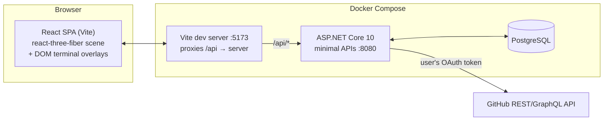

# Architecture — CYBER-DASHBOARD // BLACKWALL

*Phase 0 design. Living document — update as decisions land in [DECISIONS.md](DECISIONS.md).*

---

## 1. System overview



**One origin.** The browser only ever talks to the Vite origin (`localhost:5173`); Vite proxies `/api` to the API container. That makes plain `SameSite=Lax` cookie auth work with zero CORS configuration. In production the API serves the built SPA itself (same idea, one container).

**The API is the only thing holding secrets.** GitHub OAuth token never reaches the browser (it is encrypted at rest on the user row); the SPA only ever sees JSON shaped by our API. There is no client secret at all — the device flow (D-14) needs only the public client id.

---

## 2. The experience

### 2.1 Scroll journey (Acts 1–5)

The whole journey is **one R3F `<Canvas>`** with a scroll rig mapping normalized progress `t ∈ [0,1]` to: camera position along a `CatmullRomCurve3`, per-act shader uniforms, and postprocessing intensities.

| Act | t range | Scene content | Key tech |
|-----|---------|--------------|----------|
| 1 — Approach | 0.00–0.25 | Void, dust particles, the **Blackwall**: large plane, custom GLSL (layered FBM noise, red emissive bands crawling upward, occasional lightning filaments). Glitching HUD text (`BLACKWALL // PERIMETER`). | custom `ShaderMaterial`, drei `Text`/`Html` for HUD |
| 2 — Contact | 0.25–0.40 | Camera accelerates into the wall. Wall shader amplitude + Glitch/ChromaticAberration postFX ramp to a whiteout-in-red. | postprocessing uniforms driven by `t` |
| 3 — Breach | 0.40–0.70 | Data tunnel: camera inside a long tube; instanced glyph quads + light streaks flying past; lore text fragments drift by. | `InstancedMesh`, additive blending, fog |
| 4 — Decompression | 0.70–0.85 | Tunnel decays; the office room fades in from wireframe → lit (shader dissolve or material crossfade). | material lerp, `EffectComposer` settling |
| 5 — The Den | 0.85–1.00 | Camera settles into the room at desk height. Scroll input ends; **interactive mode** begins. | camera handoff to `CameraControls` |

Scroll implementation: **GSAP ScrollTrigger + Lenis** (smooth scroll) writing progress into a zustand store; `useFrame` reads it. (Alternative considered: drei `ScrollControls` — see DECISIONS D-04.) A DOM element ~600vh tall provides the scroll length; the canvas is fixed.

### 2.2 Interactive mode (the room)

- Room contents: desk, 2 monitors (interactable), tower/deck, chair, neon signage, window with rain/skyline card, cables, clutter. Red/black Arasaka-inspired palette, emissive accents, 1 key light + neon fills.
- Idle behavior: subtle camera parallax on pointer move (few degrees), monitor screens run animated shader "screensavers" (scanlines + logo).
- **Monitor interaction:** hover → screen brightens + edge glow (raycast highlight). Click → GSAP camera dolly to a head-on framing of that screen (~0.8s), then a fullscreen DOM terminal overlay fades in, visually matched to the screen bezel (CRT curvature frame, scanline overlay). `ESC` or an on-screen `[DISCONNECT]` reverses it.
- Why DOM overlay instead of in-3D UI: crisp text, native input/IME/copy-paste/accessibility for free. The 3D screen still renders a low-res mirror of the terminal (nice-to-have later via render-to-texture; not required for v1).

### 2.3 Terminals

Both terminals share one React terminal core (custom, ~keyboard-driven; not xterm.js unless we later want PTY-grade behavior):

- prompt, blinking block cursor, command history (↑/↓), `Tab` autocomplete, `clear`, `help`
- typewriter output rendering, ASCII banners on boot ("ARASAKA TRUST v2.3.1 — UNAUTHORIZED ACCESS WILL BE TRACED")
- a **command registry**: `{ name, args schema, handler, help }` per command; handlers call typed API client functions. Parsing is client-side; the API stays clean REST (see DECISIONS D-03).

---

## 3. Frontend architecture

```
client/src/
├── app/                 # app shell, router-less view state machine
├── scene/               # R3F: acts, room, cameras, lights
│   ├── acts/            # Act1Blackwall, Act3Tunnel, Act5Den...
│   ├── materials/       # shaderMaterials (blackwall, dissolve, screenGlow)
│   └── rig/             # scrollRig, cameraRig, transitions
├── fx/                  # postprocessing chain + presets per act
├── terminal/            # terminal core: renderer, registry, parser
│   ├── wallet/          # WALLET.SYS command set
│   └── repo/            # REPO.NET command set
├── api/                 # typed fetch client (thin, hand-rolled)
├── state/               # zustand stores
└── ui/                  # DOM HUD, overlays, loading/boot screen
```

- **State (zustand):** `useJourney` (scroll t, current act, mode: `journey | den | terminal:<id>`), `useWallet` (cache of balance/history), `useSession` (user, GitHub link status).
- **View state machine, not a router.** One page; mode transitions gate input handlers (scroll vs pointer vs keyboard).
- **Loading:** boot screen styled as a BIOS/breach sequence while `useProgress` tracks asset loading; enter on click (also unlocks audio later).
- **Quality tiers:** `high | medium | low` chosen via drei `PerformanceMonitor` — scales DPR (max 2 → 1), postFX passes, instance counts, shader octaves.

---

## 4. Backend architecture

```
server/
├── src/Api/
│   ├── Features/
│   │   ├── Auth/        # GitHub OAuth endpoints, session
│   │   ├── Wallet/      # accounts, transactions, salary
│   │   ├── Budgets/     # goals, funding, lifecycle
│   │   └── Repos/       # GitHub stats (cached)
│   ├── Domain/          # entities + invariants
│   ├── Data/            # DbContext, migrations, seeding
│   └── Program.cs       # minimal API composition
└── tests/Api.Tests/     # WebApplicationFactory + Testcontainers
```

- **Minimal APIs**, feature-folder layout, one endpoint-mapping extension per feature.
- **Wallet invariants live server-side** (balance can't go negative, budget escrow/refund is transactional). Client parses commands; server enforces rules.
- **GitHub service** (`Repos/GitHubApiClient`): thin typed `HttpClient` against the REST API (Octokit hides Link headers and lacks ETag support — research 03 §4) plus one GraphQL query for commit/PR totals; per-user in-memory cache, fresh for 60 s (HIT), then `If-None-Match` revalidation (a 304 is REVALIDATED and rate-limit-free), else MISS. Every round trip is logged with the verdict and the remaining rate budget; every `/api/repos/*` response carries `X-Cache`. Base URLs are configurable so `tools/github-stub` can stand in for GitHub offline.
- **Auth** (`Auth/`): cookie session; GitHub connected through the OAuth *device flow* (§8). The access token is Data-Protection encrypted on the user row; the key ring lives in Postgres so a container rebuild keeps sessions and tokens valid.
- **Salary:** calendar windows in the user's timezone with one `--force` per window (D-11) — no background scheduler.

---

## 5. Data model

```mermaid
erDiagram
    USER ||--|| ACCOUNT : owns
    USER ||--o{ BUDGET : tracks
    USER ||--o{ USER_SETTING : configures
    ACCOUNT ||--o{ TRANSACTION : records
    BUDGET ||--o{ TRANSACTION : "funded by"

    USER {
        guid Id PK
        string Handle
        long GitHubId "null only for the unclaimed dev seed"
        string GitHubLogin
        string AvatarUrl
        string GitHubTokenCipher "Data-Protection encrypted access token"
        datetime GitHubLinkedAt
        datetime LastLoginAt
        datetime CreatedAt
    }
    ACCOUNT {
        guid Id PK
        guid UserId FK
        string Provider "e.g. ARASAKA TRUST"
        string Alias "account name"
        decimal Balance "numeric(14,2)"
        decimal SalaryAmount
        datetime SalaryLastClaimedAt "UTC; window-bucketed in user tz"
        datetime SalaryLastForcedAt "the once-per-window --force slot"
    }
    TRANSACTION {
        guid Id PK
        guid AccountId FK
        guid BudgetId FK "nullable"
        decimal Amount "signed"
        string Kind "Pay|Income|Salary|BudgetFund|BudgetRefund"
        string Memo
        datetime CreatedAt
    }
    BUDGET {
        guid Id PK
        guid UserId FK
        int Seq "terminal-facing id, unique per user"
        string Name "wanted item"
        decimal TargetAmount
        decimal FundedAmount
        string Status "Active|Reached|Cancelled"
        datetime CreatedAt
        datetime ClosedAt "nullable"
    }
    USER_SETTING {
        guid UserId PK_FK
        string Key PK "registry-validated"
        string Value
    }
```

**Budget mechanics (escrow):** `budget fund <id> <amt>` moves money `Balance → FundedAmount` (writes a `BudgetFund` transaction), clamping to the remaining target. The fund call that crosses the target auto-locks the budget to `Reached` and returns the celebratory output (D-12: celebration only — no purchase mechanic; the user buys the item in real life). Cancelling refunds the escrow (`BudgetRefund`) and is legal on `Active` *and* `Reached` — that's how escrow is reclaimed after the real-life purchase. Delete only if the budget has no transactions. Money is conserved and every movement is a `TRANSACTION` row, so `history` is trivially complete.

**Salary windows (D-11):** claims are bucketed by *calendar* window in the user's timezone (`X-Timezone` header, IANA name; invalid → UTC) — `wallet.salary.cadence` picks monthly (`yyyy-MM`, default) or weekly (ISO year-week). One normal claim per window; `salary --force` succeeds once more per window (hard cap 2). Both timestamps stored UTC on the account.

**Settings registry (D-13):** only known keys are accepted, each with a type, validation, and default. `wallet.account.alias` and `wallet.salary.amount` write through to `ACCOUNT` columns; `wallet.salary.cadence` and `wallet.history.pagesize` live in `USER_SETTING`. Mutations require the terminal's `sudo` prefix (themed `PERMISSION DENIED` without it).

**Identity (D-06, Phase 5):** a user is a GitHub identity. On a completed login: a user with that `GitHubId` is refreshed; else the oldest *unlinked* user (the dev seed) is **claimed** — its Phase 4 ledger becomes this identity's wallet; else a new user + account is created with one `Income` row of €$ 2,077.00 ("welcome bonus"), so conservation holds from the first row. `Handle` is set to the GitHub login.

Concurrency: balance updates go through one transactional service method; Postgres `xmin` as EF concurrency token as a belt-and-suspenders. The `DataProtectionKeys` table (ASP.NET Data Protection key ring) also lives here.

---

## 6. API surface (v1)

| Method & path | Purpose |
|---|---|
| `POST /api/auth/github/device/start` | begin the device flow → `{ handle, userCode, verificationUri, expiresIn, interval }` (anonymous) |
| `POST /api/auth/github/device/poll` | `{ handle }` → `{ status: pending \| complete, retryIn?, user? }`; completion sets the session cookie (anonymous) |
| `POST /api/auth/logout` | kill session (anonymous, idempotent) |
| `GET /api/me` | session user (handle, GitHub login/avatar/linkedAt) + account summary |
| `GET /api/wallet` | balance, alias, provider, salary status (window, claim/force availability) |
| `POST /api/wallet/pay` | `{ amount, memo? }` → debit |
| `POST /api/wallet/income` | `{ amount, memo? }` → credit |
| `POST /api/wallet/salary/claim` | `{ force? }` — per D-11 window rules |
| `GET /api/wallet/transactions?take=&kind=&budget=` | history, newest first, optional filters; default take from `wallet.history.pagesize` |
| `GET /api/wallet/stats` | current-window income/spend/net/top expense + escrowed + all-time |
| `GET /api/budgets` | list budgets + status |
| `POST /api/budgets` | `{ name, target }` |
| `POST /api/budgets/{seq}/fund` | `{ amount }` escrow from balance; clamps; may flip to Reached |
| `POST /api/budgets/{seq}/cancel` | refund escrow, close (Active or Reached) |
| `DELETE /api/budgets/{seq}` | remove (only if it has no transactions) |
| `GET /api/config` | settings registry: keys, values, defaults |
| `PUT /api/config/{key}` | `{ value }` — validated against the registry |
| `DELETE /api/config/{key}` | reset key to default |
| `GET /api/repos` | owned repos, most recently pushed first (name, stars, forks, language, pushed) |
| `GET /api/repos/{owner}/{name}/summary` | repo card + latest commit + totals (commits, PRs open/closed/merged) |
| `GET /api/repos/{owner}/{name}/commits?take=` | default-branch commit total + the last `take` (≤ 25) |
| `GET /api/repos/{owner}/{name}/pulls?take=` | open PRs (≤ 25) + open/closed/merged totals |
| `GET /api/repos/rate` | live GitHub rate budget for core / search / graphql (never cached) |

All wallet/budget/config/repo routes require the session cookie; unauthenticated calls get `401 { code: "ACCESS_DENIED" }` which the terminal renders as `ACCESS DENIED — run: login`. A stored GitHub token GitHub no longer honours surfaces as `401 UPLINK_REVOKED` — same remedy. Repo responses carry `X-Cache: HIT | REVALIDATED | MISS | BYPASS`.

Wallet errors are 4xx JSON `{ code, message, meta? }` — the server owns the invariant, the client owns the drama (D-03): codes like `OVERDRAFT`, `SALARY_ALREADY_CLAIMED`, `SALARY_FORCE_EXHAUSTED` map to themed terminal output client-side. The client sends `X-Timezone` (IANA) on every request for D-11 window math.

---

## 7. Terminal command spec

### WALLET.SYS
| Command | Effect |
|---|---|
| `help`, `clear`, `whoami` | utility |
| `balance` | balance, alias, provider, salary readiness |
| `pay <amount> [memo…]` | debit; refuses overdraft with themed error |
| `income <amount> [memo…]` | credit (freelance gig flavor) |
| `salary [--force]` | claim per window (D-11); refusal hints at `--force`, force works once |
| `history [n] [--kind k] [--budget id]` | last n transactions, table (default n from config) |
| `stats` | current-window income/spend/net + escrow + all-time |
| `budget` | list budgets: seq, name, funded/target, `[████──] %` bar, status |
| `budget add <name…> <target>` | create goal (last token is the target) |
| `budget fund <id> <amount>` | escrow into goal; clamps; crossing the target celebrates + locks Reached |
| `budget cancel <id>` | cancel + refund (Active or Reached) |
| `budget rm <id>` | delete, only if never used |
| `config list` / `config get <key>` | read settings (no sudo) |
| `sudo config set <key> <value>` | mutate a registry key; without `sudo` → `PERMISSION DENIED` |
| `sudo config reset <key>` | back to default |

### REPO.NET
| Command | Effect |
|---|---|
| `login` / `logout` | GitHub device flow inside the CRT (D-14) / burn the session — available in *both* terminals |
| `repos [n] [--all]` | owned repos: name, ★, language, pushed |
| `repo [name]` | summary card: branch, stars/forks/watchers/issues, latest commit, totals |
| `latest [name]` | latest commit: sha, author, message, when |
| `commits [name]` | total on the default branch + last 5 |
| `prs [name] [--all]` | open PRs (default) or totals open/closed/merged |
| `rate` | GitHub API budget left (core / search / graphql) |
| `config …` / `sudo config …` | the same registry as WALLET.SYS, incl. `repo.default` |

`[name]` is `owner/name`, or a bare `name` under the operator's GitHub login; omitted, it falls back to the `repo.default` config key (D-14). Every repo answer ends with the relay's cache verdict.

Shared niceties: unknown command → glitchy `COMMAND NOT RECOGNIZED`, `Tab` completion, `↑` history, boot banner per OS, a motd after the banner naming the operator — or `ACCESS DENIED — run: login`.

---

## 8. Auth flow (BFF-style)

*Reworked for D-14 (device flow) in Phase 5. No redirects, no callback URL, no client secret — the whole ceremony stays inside the CRT.*

1. Terminal `login` → `POST /api/auth/github/device/start` → the server asks GitHub for a device code (`read:user repo` — D-02) and keeps the real `device_code` in memory behind an opaque handle → the terminal prints `ENTER CODE XXXX-XXXX AT github.com/login/device`, copies the code to the clipboard and opens the page (both best-effort).
2. The terminal polls `POST /api/auth/github/device/poll { handle }` at GitHub's interval; the server enforces that interval itself and honours `slow_down`. Pending answers are `{ status: "pending" }`; expiry / denial are typed 4xx codes.
3. On approval the server exchanges the device code for the access token, fetches `/user`, and in one transaction upserts the user (**claiming** the unlinked dev seed on first login, else creating an account with the €$ 2,077.00 welcome row — §5), **vaults the token** (Data-Protection encrypted in `USER.GitHubTokenCipher`; key ring in Postgres) and issues the session cookie (`blackwall.sid`, `HttpOnly`, `SameSite=Lax`, 30-day sliding). The poll returns `{ status: "complete", user }` → `UPLINK ESTABLISHED`.
4. The SPA never sees GitHub tokens; it calls `/api/repos/*` and the server calls GitHub with the vaulted token through the cache. `logout` signs the cookie out; the ledger stays.
5. Offline: `compose.github-stub.yml` points both GitHub base URLs at `tools/github-stub`, which runs the same ceremony with an approve page at `localhost:9797/login/device`.

---

## 9. Performance budget & fallbacks

- Target: 60fps desktop mid-range GPU; DPR ≤ 2; ≤ 2 postFX passes hot at once (Bloom always; Glitch/CA only during Act 2 spike).
- Poly budget for the room: < 150k tris total; bake what we can into emissive textures.
- Instanced tunnel: single `InstancedMesh` (≤ 5k instances) + one streak shader.
- `frameloop="always"` during journey (uniforms animate), consider `demand` inside terminals (scene mostly idle behind overlay).
- Asset pipeline: glTF through `gltf-transform` (meshopt + KTX2) budgeted < 15 MB total, lazy-loaded after Act 1 shell paints.
- Reduced-motion / weak-GPU fallback: skip smooth-scroll hijack, simplify shaders (fewer octaves), static room lighting.

## 10. Constraints & non-goals (v1)

- Wallet is **fictional** — no bank integration, no real money semantics beyond decimal correctness.
- Single-user-per-account focus; no orgs/teams, no repo write operations (read-only GitHub).
- Desktop-first; mobile gets the journey + read-only dashboards, not full terminal UX.
- Fan project: no CP2077 assets/logos; original shaders/models in the style. Fictional brand names kept generic enough to swap.
